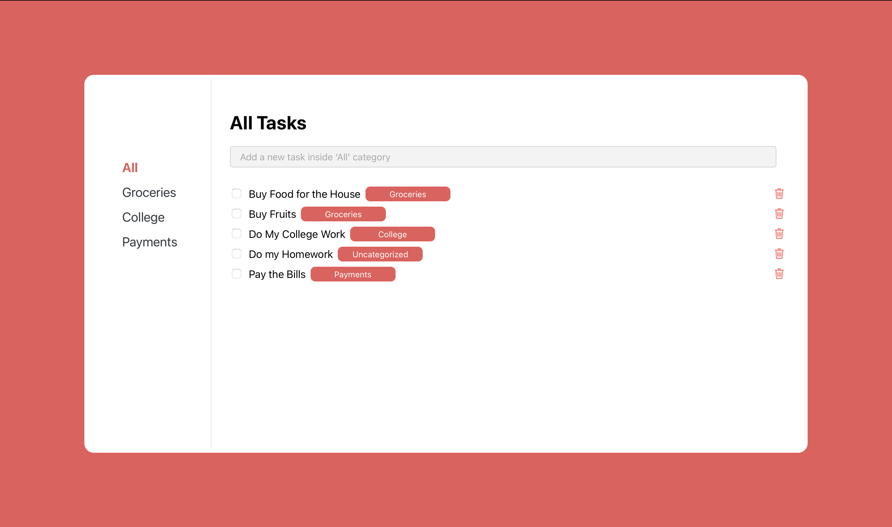

# 📝 Task Manager App

A minimalist React + TypeScript to-do list app with category filtering, persistent localStorage, and real-time UI reordering. Built to be clean, fast, and easy to extend.

---

## 📸 Preview

 <!-- Optional: You can add a screenshot in your repo -->

---

## ⚙️ Features

- ✅ **Add, check, and delete tasks**
- 🗃️ **Organize by category**: Groceries, College, Payments, etc.
- 🔍 **Search input adds tasks**: Hit Enter to submit
- 🗂️ **Category-based filtering** via Sidebar
- 🔄 **Checked tasks are sorted to bottom**
- 🔠 **Unchecked tasks are alphabetically sorted**
- 💾 **Persistent state with localStorage**
- 🎨 **Custom styling with red accents and category badges**
- 🖱️ **Custom checkbox styling using `accent-color`**

---

## 📁 Project Structure

```
src/
├── Components/
│   ├── Sidebar.tsx       # Sidebar with clickable categories
│   ├── SearchBar.tsx     # Input to add new tasks
│   └── Task.tsx          # Task row with checkbox and delete
├── images/
│   └── Vector.png        # Trash icon for delete
├── App.tsx               # Main logic, task list, and state
├── custom.d.ts           # Type declarations for image imports
└── index.tsx             # Entry point
```

---

## 🚀 Getting Started

### 1. Clone the repo
```bash
git clone https://github.com/YOUR_USERNAME/task-manager.git
cd task-manager
```

### 2. Install dependencies
```bash
npm install
# or
yarn
```

### 3. Run the app
```bash
npm start
# or
yarn start
```

### 4. Open in browser
Visit [http://localhost:3000](http://localhost:3000)

---

## 🧠 How It Works

### Task Handling
- **Add** a task: Type in the input, press Enter
- **Checkbox** toggles the task’s `checked` state
- **Trash icon** deletes the task

### Category Behavior
- Tasks are tied to categories
- Adding tasks while viewing `"All"` puts them into `"Uncategorized"`
- Tasks only display when their category matches the one selected in the sidebar

### Sorting Logic
- Unchecked tasks are **alphabetically sorted** and appear **above**
- Checked tasks are also **alphabetically sorted**, but pushed **below**

### Persistence
- All tasks (including checked state) are saved into `localStorage`
- On page reload, the app restores tasks automatically

---

## 📦 Technologies Used

- ⚛️ React (with Hooks)
- 🧠 TypeScript
- 💅 Inline styles (no frameworks)
- 🗃️ Local Storage API

---

## 📄 License

This project is licensed under the [MIT License](LICENSE).

---
